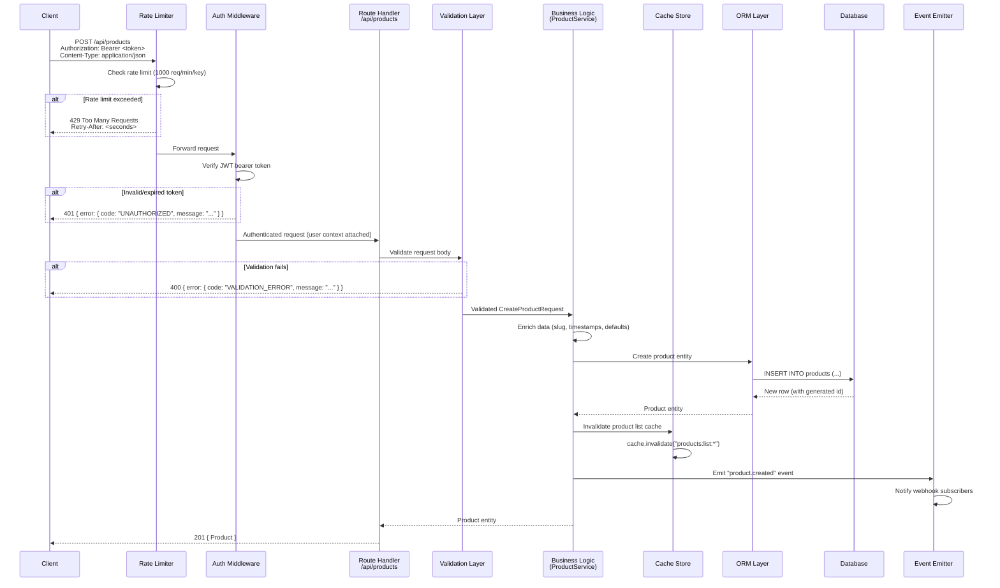

# API Data Flow Architecture — POST /api/products

> **Purpose:** Onboarding reference and microservices migration planning guide.
> Traces the complete lifecycle of a `POST /api/products` request from HTTP
> entry point to database persistence and response construction.

---

## Data Flow Diagram



### ASCII Overview

```
Client Request
    │
    ▼
┌──────────────────┐
│  Rate Limiter     │──── 429 Too Many Requests
│  (1000 req/min)   │
└────────┬─────────┘
         │
         ▼
┌──────────────────┐
│  Auth Middleware   │──── 401 Unauthorized
│  (JWT validation)  │
└────────┬─────────┘
         │
         ▼
┌──────────────────┐
│  Route Handler    │     POST /api/products
│  (products.ts)    │     operationId: createProduct
└────────┬─────────┘
         │
         ▼
┌──────────────────┐
│  Validation Layer │──── 400 Validation Error
│  (schema check)   │
└────────┬─────────┘
         │
         ▼
┌──────────────────┐
│  Business Logic   │     Slug generation, timestamps,
│  (ProductService) │     default values, enrichment
└────────┬─────────┘
         │
    ┌────┴────┐
    ▼         ▼
┌────────┐ ┌─────────────┐
│  ORM   │ │ Cache Store  │
│ Layer  │ │ (invalidate) │
└───┬────┘ └─────────────┘
    │
    ▼
┌────────┐
│   DB   │  INSERT INTO products
└───┬────┘
    │
    ▼
┌─────────────┐
│ Event Emit  │  "product.created" → Webhook delivery
└─────────────┘
    │
    ▼
  201 Response { Product }
```

---

## Layer-by-Layer Breakdown

### 1. HTTP Entry Point — Route Handler

| Property      | Value                                      |
|---------------|--------------------------------------------|
| **Method**    | `POST`                                     |
| **Path**      | `/api/products`                            |
| **Operation** | `createProduct`                            |
| **Tags**      | `Products`                                 |
| **File**      | `src/routes/products.ts` (see feature/openapi-spec-generation branch) |

The route is registered via the central route registry (`src/routes/index.ts`),
which re-exports all route definitions. Each route is defined as a
`RouteDefinition` object with OpenAPI JSDoc annotations:

```typescript
// src/routes/products.ts
export const createProduct: RouteDefinition = {
  method: 'post',
  path: '/api/products',
  operationId: 'createProduct',
  tags: ['Products'],
};
```

**Data shape entering this layer:**

```
HTTP Request
├── Headers
│   ├── Authorization: Bearer <JWT>
│   ├── Content-Type: application/json
│   └── X-API-Key: <key> (for rate limiting)
└── Body (JSON)
    └── CreateProductRequest
```

**Error handling:** Malformed JSON → `400 Bad Request` before reaching validation.

---

### 2. Rate Limiting

| Property        | Value                                     |
|-----------------|-------------------------------------------|
| **Limit**       | 1000 requests per minute per API key      |
| **Scope**       | Per API key                               |
| **File**        | `src/middleware/rate-limit.ts` (see feature/rate-limiting-middleware branch) |

The rate limiter runs before authentication. When the limit is exceeded, the
response includes a `Retry-After` header indicating seconds until the client
can retry.

**Error response:**

```json
HTTP 429 Too Many Requests
Retry-After: 42

{
  "error": "Too Many Requests",
  "retryAfter": 42
}
```

---

### 3. Authentication — JWT Validation

| Property       | Value                                      |
|----------------|--------------------------------------------|
| **Mechanism**  | JWT bearer token                           |
| **Header**     | `Authorization: Bearer <token>`            |
| **Token type** | Access token (obtained via `POST /api/auth/login`) |

The auth middleware verifies the JWT signature, checks expiration, and attaches
the decoded user context to the request object. Tokens are obtained through the
Auth API (`/api/auth/login`, `/api/auth/register`) and can be refreshed via
`/api/auth/refresh`.

**Data shape after auth:**

```
Request + User Context
├── user.id: string
├── user.email: string
├── user.role: string (e.g., "admin", "user")
└── body: CreateProductRequest (unchanged)
```

**Error response:**

```json
HTTP 401 Unauthorized

{
  "error": {
    "code": "UNAUTHORIZED",
    "message": "Invalid or expired authentication token."
  }
}
```

---

### 4. Validation Layer

| Property         | Value                                    |
|------------------|------------------------------------------|
| **Validates**    | Request body against `CreateProductRequest` schema |
| **Approach**     | Schema-based validation (JSON Schema / Zod-style) |

The validation layer checks that all required fields are present and conform
to the expected types and constraints.

**`CreateProductRequest` schema:**

```typescript
interface CreateProductRequest {
  name: string;          // Required, 1-200 chars
  description: string;   // Required, 1-5000 chars
  price: number;         // Required, > 0
  category: string;      // Required, must match known category
  sku?: string;          // Optional, unique if provided
  images?: string[];     // Optional, array of URLs
  metadata?: Record<string, unknown>;  // Optional, freeform
}
```

**Validation checks:**

1. `name` — Required, non-empty, max 200 characters
2. `description` — Required, non-empty, max 5000 characters
3. `price` — Required, must be positive number
4. `category` — Required, must exist in categories table
5. `sku` — If provided, must be unique across products
6. `images` — If provided, each must be a valid URL
7. `metadata` — If provided, must be a valid JSON object

**Error response:**

```json
HTTP 400 Bad Request

{
  "error": {
    "code": "VALIDATION_ERROR",
    "message": "Validation failed",
    "details": [
      { "field": "price", "message": "Must be a positive number" },
      { "field": "name", "message": "Required field is missing" }
    ]
  }
}
```

---

### 5. Business Logic — ProductService

| Property           | Value                                  |
|--------------------|----------------------------------------|
| **Responsibility** | Data enrichment, business rules, orchestration |
| **Coordinates**    | ORM, Cache, Event emission             |

After validation passes, the business logic layer enriches and transforms
the data before persistence:

**Transformations and enrichments:**

1. **Slug generation** — Derives a URL-friendly slug from the product name
   (e.g., `"Premium Widget"` → `"premium-widget"`). Handles duplicates
   by appending a numeric suffix.
2. **Timestamps** — Sets `createdAt` and `updatedAt` to current UTC time.
3. **Defaults** — Sets `status: "draft"`, `inventory: 0`, `rating: null`.
4. **Creator tracking** — Records `createdBy: user.id` from auth context.
5. **SKU generation** — If no SKU provided, auto-generates one from
   category prefix + sequential number.

**Data shape after enrichment:**

```typescript
interface ProductEntity {
  // Auto-generated
  id: string;            // UUID, generated by database
  slug: string;          // Derived from name
  createdAt: string;     // ISO 8601 UTC
  updatedAt: string;     // ISO 8601 UTC
  createdBy: string;     // From auth context
  status: "draft";       // Default

  // From request
  name: string;
  description: string;
  price: number;
  category: string;
  sku: string;           // Provided or auto-generated
  images: string[];      // Provided or empty array
  metadata: Record<string, unknown> | null;
}
```

**Error handling:**

- Duplicate SKU → `409 Conflict`
- Category not found → `400 Validation Error`
- Internal service error → `500 Internal Server Error`

---

### 6. Database Layer — ORM & Persistence

| Property       | Value                                      |
|----------------|--------------------------------------------|
| **ORM**        | Version 5.4 (upgraded from 5.2)            |
| **Operation**  | `INSERT INTO products`                     |
| **Table**      | `products`                                 |

The ORM maps the `ProductEntity` to the `products` database table. The
product entity includes several associations that are loaded via the ORM's
eager-loading mechanism.

**Database schema (`products` table):**

```sql
CREATE TABLE products (
  id          UUID PRIMARY KEY DEFAULT gen_random_uuid(),
  name        VARCHAR(200) NOT NULL,
  slug        VARCHAR(220) NOT NULL UNIQUE,
  description TEXT NOT NULL,
  price       DECIMAL(10,2) NOT NULL CHECK (price > 0),
  category    VARCHAR(100) NOT NULL REFERENCES categories(name),
  sku         VARCHAR(50) UNIQUE,
  status      VARCHAR(20) NOT NULL DEFAULT 'draft',
  images      JSONB DEFAULT '[]',
  metadata    JSONB,
  inventory   INTEGER DEFAULT 0,
  rating      DECIMAL(3,2),
  created_by  UUID NOT NULL REFERENCES users(id),
  created_at  TIMESTAMPTZ NOT NULL DEFAULT NOW(),
  updated_at  TIMESTAMPTZ NOT NULL DEFAULT NOW()
);

-- Indexes
CREATE INDEX idx_products_category ON products(category);
CREATE INDEX idx_products_status ON products(status);
CREATE INDEX idx_products_created_at ON products(created_at);
CREATE UNIQUE INDEX idx_products_sku ON products(sku) WHERE sku IS NOT NULL;
```

**Associations (loaded on read operations):**

| Association      | Type        | Table              | Notes                           |
|------------------|-------------|--------------------|---------------------------------|
| Categories       | belongs-to  | `categories`       | Product category reference      |
| Images           | has-many    | `product_images`   | Extended image metadata         |
| Recommendations  | many-to-many| `recommendations`  | Related product suggestions     |

> **⚠️ Known issue (ORM 5.4):** The ORM upgrade from 5.2 to 5.4 changed the
> default eager-loading strategy from `join` to `select`. This caused an N+1
> query regression on `GET /api/products` (list), turning 2 JOINed queries into
> 42 individual SELECTs. Only the list endpoint is affected because it is the
> only one that eager-loads multiple nested associations. See the
> [Performance Regression RCA](./product-endpoint-perf-regression-rca.md) for
> full details. For `POST`, the INSERT is a single query and is not affected.

**Error handling:**

- Unique constraint violation (slug, sku) → catches DB error, returns `409 Conflict`
- Foreign key violation (invalid category) → returns `400 Bad Request`
- Connection failure → retries with exponential backoff, then `503 Service Unavailable`

---

### 7. Caching Layer

| Property          | Value                                   |
|-------------------|-----------------------------------------|
| **Implementation**| `CacheStore` with per-key locking       |
| **File**          | `src/cache/store.ts` (see fix/cache-race-condition branch) |
| **Strategy**      | Write-through with invalidation on mutation |

On `POST /api/products` (and all write operations), the cache layer
**invalidates** rather than populates:

1. **Invalidate list cache** — `cache.invalidate("products:list:*")` removes
   all cached paginated product list responses so the next `GET /api/products`
   fetches fresh data.
2. **No write-through for new items** — The newly created product is not
   pre-cached; it will be cached on first read.

The cache store uses a per-key mutex to prevent race conditions during
concurrent updates:

```typescript
// Atomic read-modify-write under lock
await cache.update(key, (current) => newValue);

// Conditional write (optimistic concurrency)
await cache.setIfVersion(key, value, expectedVersion);
```

**Cache keys affected by product creation:**

| Key Pattern              | Action      | Reason                              |
|--------------------------|-------------|-------------------------------------|
| `products:list:*`        | Invalidated | List results are now stale          |
| `products:count`         | Invalidated | Total count has changed             |
| `search:*`               | Invalidated | Search index may include new product|

**Error handling:** Cache failures are non-fatal — the request succeeds even
if cache invalidation fails (logged as warning, not propagated to client).

---

### 8. Event Emission

| Property      | Value                                      |
|---------------|--------------------------------------------|
| **Event**     | `product.created`                          |
| **Delivery**  | Webhook HTTP POST with retry + exponential backoff |
| **File**      | `src/middleware/webhook-retry.ts` (see feature/webhook-retry-exponential-backoff branch) |

After successful database persistence, a `product.created` event is emitted.
Registered webhook subscribers receive an HTTP POST notification:

**Event payload:**

```json
{
  "event": "product.created",
  "timestamp": "2026-04-02T22:30:00.000Z",
  "data": {
    "id": "550e8400-e29b-41d4-a716-446655440000",
    "name": "Premium Widget",
    "slug": "premium-widget",
    "price": 29.99,
    "category": "widgets",
    "status": "draft",
    "createdBy": "user-uuid",
    "createdAt": "2026-04-02T22:30:00.000Z"
  }
}
```

**Webhook delivery guarantees:**

- Retry with exponential backoff on failure (5xx or timeout)
- Maximum 5 retry attempts
- Backoff intervals: 1s, 2s, 4s, 8s, 16s
- Webhook endpoints registered via `POST /api/webhooks`

**Error handling:** Webhook delivery failures are asynchronous and do not
affect the API response. Failed deliveries are logged and retried in the
background.

---

### 9. Response Construction

After all layers complete successfully, the route handler constructs and
returns the response:

**Success response:**

```json
HTTP 201 Created
Content-Type: application/json

{
  "id": "550e8400-e29b-41d4-a716-446655440000",
  "name": "Premium Widget",
  "slug": "premium-widget",
  "description": "A premium widget for all your needs",
  "price": 29.99,
  "category": "widgets",
  "sku": "WDG-00042",
  "status": "draft",
  "images": [],
  "metadata": null,
  "inventory": 0,
  "rating": null,
  "createdBy": "user-uuid",
  "createdAt": "2026-04-02T22:30:00.000Z",
  "updatedAt": "2026-04-02T22:30:00.000Z"
}
```

**Response construction rules:**

1. The full `Product` entity is returned (not a subset)
2. Internal fields (e.g., `_version`, `_deleted`) are stripped
3. Timestamps are serialized as ISO 8601 strings
4. HTTP status is `201 Created` (not `200 OK`)
5. No `Location` header is set (could be improved)

---

## Error Summary — All Layers

| Layer           | HTTP Status | Error Code           | Trigger                        |
|-----------------|-------------|----------------------|--------------------------------|
| Rate Limiter    | 429         | *(simple format)*    | > 1000 req/min/key             |
| Auth Middleware | 401         | `UNAUTHORIZED`       | Missing/invalid/expired JWT    |
| Validation      | 400         | `VALIDATION_ERROR`   | Missing/invalid fields         |
| Business Logic  | 409         | `CONFLICT`           | Duplicate SKU or slug          |
| Database        | 503         | `SERVICE_UNAVAILABLE`| DB connection failure          |
| Internal        | 500         | `INTERNAL_ERROR`     | Unexpected server error        |

Most layers follow the standard error format:

```json
{
  "error": {
    "code": "ERROR_CODE",
    "message": "Human-readable description"
  }
}
```

> **Note:** The rate limiter uses a simpler format (`{ "error": "Too Many Requests", "retryAfter": N }`)
> that predates the standard error convention. Consider aligning it in a future refactor.

---

## File Reference Map

| Layer              | File                                 | Branch                                   |
|--------------------|--------------------------------------|------------------------------------------|
| Route definition   | `src/routes/products.ts`             | `feature/openapi-spec-generation`        |
| Route registry     | `src/routes/index.ts`                | `feature/openapi-spec-generation`        |
| Route types        | `src/openapi/types.ts`               | `feature/openapi-spec-generation`        |
| Rate limiting      | `src/middleware/rate-limit.ts`        | `feature/rate-limiting-middleware`        |
| Cache store        | `src/cache/store.ts`                 | `fix/cache-race-condition`               |
| Webhook retry      | `src/middleware/webhook-retry.ts`     | `feature/webhook-retry-exponential-backoff` |
| API docs           | `docs/api/products.md`               | `master`                                 |
| Error handling     | `docs/guides/error-handling.md`      | `master`                                 |
| Auth docs          | `docs/authentication.md`             | `master`                                 |
| Rate limit docs    | `docs/guides/rate-limiting.md`       | `master`                                 |
| Perf RCA           | `docs/guides/product-endpoint-perf-regression-rca.md` | `investigate/product-endpoint-perf-regression` |

---

## Microservices Migration Notes

When decomposing this monolith, the `POST /api/products` flow touches these
bounded contexts:

1. **Product Service** — Route handler, validation, business logic, ORM
2. **Auth Service** — JWT validation (already stateless, easy to extract)
3. **Cache Service** — Could become a shared Redis instance
4. **Event Bus** — Webhook delivery should migrate to a message broker
   (e.g., RabbitMQ, Kafka) for durability and decoupling
5. **API Gateway** — Rate limiting moves to the gateway layer

**Recommended extraction order:**

1. Auth Service (stateless, no data dependencies)
2. Event Bus / Webhook Service (async, loosely coupled)
3. Product Service (core domain, most complex)
4. Cache layer (shared infrastructure concern)
